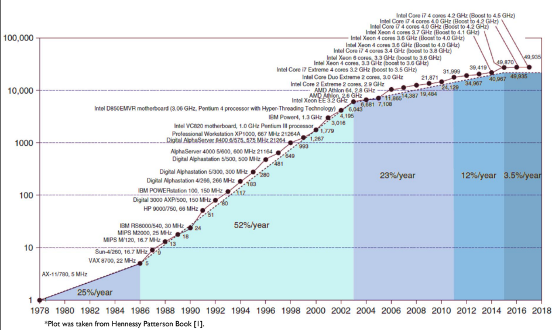

# Introduction

**Lecture 1 | 2023-09-28 | Week 0 (Thursday) |
[Slides](slides/L1-%20Introduction.pdf)**

## Computers and Abstraction

A **computer** is fundamentally a "box" with multiple layers of **abstraction**.
This simplifies how we study each component and how they ultimately build up to
what we use as a "computer", some machine that can run our programs.

This is made possible with contracts and protocols. Each layer only needs to be
concerned with its own internal implementation and only need to interact with
other layers via well-defined **interfaces**. (CS 111)

Recall the simplified model of computer abstraction layers:

* **Application software:** written in high-level programming languages which
  are themselves like translations of *algorithms* into code.
* **System software:** programs such as **compilers** then translate the program
  into machine code, which is ready to be executed by the operating system
* **Hardware:** physical memory, I/O, etc. that's in turn managed by the
  operating system above.

High level languages (applications) are written in different languages, and the
hardware layer (memory, I/O, etc.) all have different implementations, so **how
do we maintain compatibility?**

### Instruction Set Architectures

We define a *contract*, an **instruction set architecture (ISA)**. This **system
software** sits between the software and the hardware in our model, like a
middleman.

* You offer the software a well-defined set of instructions that they can play
  around with. From the software's *perspective*, they're offered some way to
  change and maintain state through "storage locations" (memory) and operations
  e.g. "add".
* The hardware is then responsible for knowing how to execute those exact
  instructions and in what order.

There are many possible implementations for a given ISA.

:warning: **In this course, we will focus on RISC-V ISA.**

**It allows hardware and software to change/evolve independently!**

> It's like maintaining a frontend and a backend in a web application. The stack
is unified by a *contract*, some API (e.g. RESTful API) where they communicate
with each other over HTTP. As long as this API stays constant (or at least
backwards compatible), the frontend and backend can pretty much develop
independently.

## Brief History

### Measures of Efficiency

1. Performance (99% of what you need)
2. Power consumption
3. Cost
4. Reliability and security

For context, ENIAC was the world's first general=purpose electronic computer
(1945). Its size was larger than a lecture room.

Technology has since expanded on multiple dimensions simultaneously:

* Processor performance
* DRAM capacity
* Power consumption efficiency
* Sheer number of transistors

All while cost becomes even cheaper. These improvements come from a combination
of *new technologies* and *innovative techniques*.

### Moore's Law

> The number of transistors in an IC doubles every two years.

More of a statement about the *economy*. The main idea is that the **cost per
transistor** is what reduces every year, which explains why we get faster chips
with smaller prices.

### Dennard's Scaling Law

Moore's Law states that the *number* of transistors increases - this means the
transistor's area is reduced by 50%, or every *dimension* by 0.7x.

A transistor has some gap length associated with it, `L`. Reducing this channel
length will increase performance:

* Voltage is reduced to keep the electric field constant (V = EL) (-30%)
* L is reduced, reducing delays (x = Vt) (-30%)
* Frequency is increased (f = 1/t) (+40%)
* Capacitance is reduced (C = kA/L) (-30%)

Consider the power equation:

$$P = CV^2f$$

The combined changes result in a 50% decrease in power consumption per
transistor. This is why even as hardware gets more powerful, the power
consumption stays about the same over the years.

### Amdahl's Law

> Performance improvement (speedup) is limited by the part you cannot improved
> (aka the **sequential part**)

$$\text{speedup} = \frac{1}{(1-p) + \frac{p}{s}}$$

* p is the part that can be improved by parallelization
* s is the factor for improvement e.g. more cores for parallelization

It makes sense -- when everything's parallelized, whatever step left that
*isn't* will be bottleneck.

If for example `speedup = 5`, that means we're limited by the fact that
computers can only get up to 5x better.

### Eras of Advancements

1. The initial growth of 25%/year in performance from 1978-1986 is from device
   technology advancements -- better hardware itself.

2. The 52%/year growth that follows in 1986-2003 (kind of like a golden age) is
   attributed to making a bunch of architectural and organizational
   optimizations like caching, branch prediction, etc.

3. The slowdown from that era onwards (2003-2011) is because as we make
   transistors smaller and smaller, they start approaching quantum sizes,
   resulting in **static power leakage**. This marks the *end* of **Dennard's
   scaling** -- we just can't get any parts to go any smaller. We also call this
   "hitting the **power wall**".

4. After 2005ish, we decided to scale *horizontally*. Instead of increasing the
   sheer number of transistors on a chip, we simply use multiple chips (cores),
   thus beginning the multi-core era. Speedup is achieved through thread-level,
   task-level, and program-level parallelism. Of course, this brings in a bunch
   of new challenges in making sure all the cores cooperate (instead of being
   counterproductive by getting in each other's way, race conditions, etc.).

5. As we approach the modern day (2015-present), we start to hit a barrier
   again. Firstly, **Amdahl's Law** shows that there's a limited amount of
   parallelism available as it is. There's also a phenomon known as **dark
   silicon** -- due to thermal management limitations, some parts of a chip
   cannot be turned on. This marks the end of **Moore's Law**.
