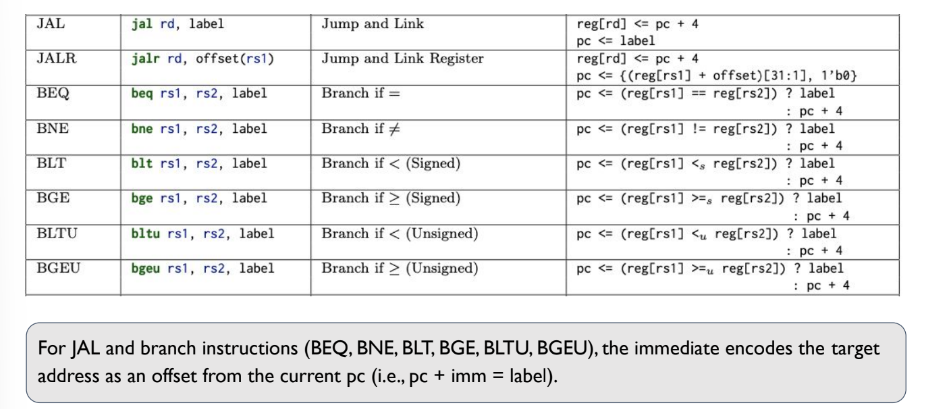
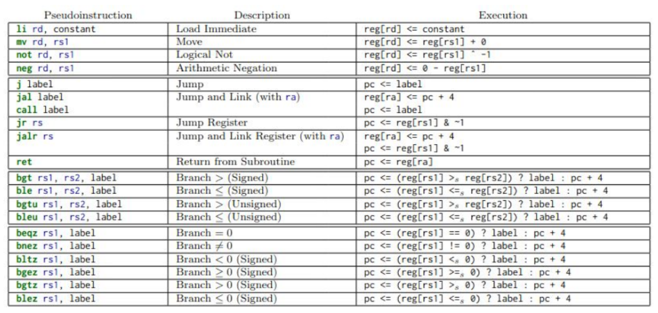
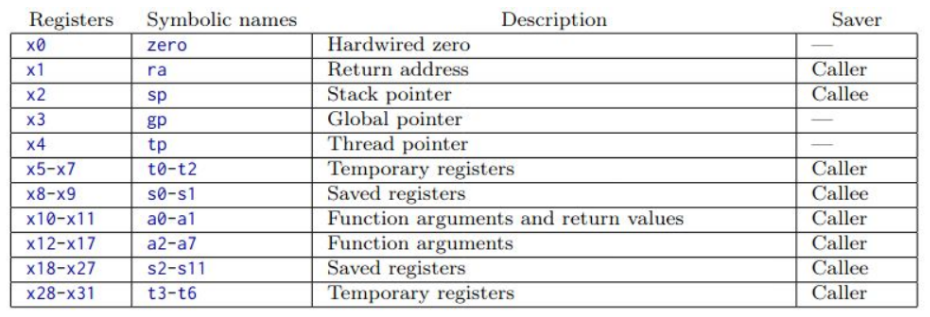

# ISA

**Lecture 2 | 2023-10-03 | Week 1 (Tuesday) | [Slides](slides/L2-%20ISA.pdf)**


## RISC-V

An ISA is often designed with a particular **microarchitectural style** in mind.
In our case:

* **RISC (reduced instruction set computer)**: hardwired, pipelined.
* **CISC (complex instruction set computer)**: microcoded.

**RISC-V** is an *open-source* RISC-based ISA (royalty-free), mostly maintained
by the open-source community.

As the name implies, RISC is very simplified compared to CISC:

* Instruction sizes are fixed e.g. all instructions are 32-bits long on a 32-bit
  architecture, as oppposed to variable instruction sizes in CISC.
* Operations are simple and one-by-one (e.g. just add and nothing else), as opposed
  to *packed* operations in CISC.

RISC is more popular than CISC. Pretty much all widely-used ISAs (except x86 by
Intel) is RISC. Everything that's based on ARM is basically RISC.

Read more about RISC
[here](https://cs.stanford.edu/people/eroberts/courses/soco/projects/risc/risccisc/).


## Store Program Computer (von Neumann)

*How do computers run instructions?*

The most dominant type of computer to this day is the **store program computer
(von Neumann computer)**.

In this model, computer hardware is basically a machine that reads instructions
one-by-one and executes them sequentially until the program finishes.

*Memory* holds BOTH program (instructions) and data, which are both modeled as a
linear memory array. Instructions can be modified AS data.

From the memory's point of view, there's no difference in if the bytes represent
an "instruction" or "data".

The CPU then needs to know what the current instruction is so it know what to
execute. It does this with a **program counter (PC)**.

The sequential instruction processing (aka the **fetch-decode-execute** or
**fetch-execute** cycle):

1. Program counter (PC) identifies current instruction.
2. Fetch instruction from memory.
3. Update state (eg. PC and memory) as a function of current state according to
   instruction.
4. Repeat.


## Building an ISA: Instructions

We need a specification for how to translate a **high-level language (HLL)** to
assembly code.

> Remember that in 32-bit RISC-V, each instruction is fixed at 32 bits.

An **instruction** fundamentally looks like:

```
<---------------32 bits -------------->
COMMAND OPERAND1 OPERAND2 ...
```

You can think of it like a function call and its arguments. A **command** is
some **operation code (opcode)** representing a specific operation e.g. `add`.
Operands on the other hand have [three forms](#instruction-operands).


## Instruction Operands

1. [Registers](#registers)
2. [Immediates](#immediates) (like constant literals)
3. [Memory](#memory)

In RISC-V, there are at most two operands per instruction.


### Registers

A **register** is a small but very fast storage unit directly inside the
processor. Registers are actually *visible* to the software.

The size of a register is a *trade-off*:

* *Larger* widths mean more data can be transferred and manipulated at a time,
  but this obviously requires more power.
* *More* registers mean you operate in the CPU more often so you don't have to
  access memory as much, but obviously this requires more area and power.

The size of the registers is thus a tuning parameter for what kind of
performance you need on your machine.

* In 32-bit RISC-V (**RV32**), we have 32 registers, 32-bit each (called
  **word**).
* In 64-bit RISC-V (**RV64**), we have 32 registers, 64-bit each (called
  **double-word**).

Conveniently, every register is named `xi`, where `i` is a number.

`x0` is *hardwired* to zero. This is because zero is often a useful value to
have. Also, because it's hardwired, attempting to overwrite the value of `x0`
won't do anything.

Registers are stored in a hardware unit called a **register file**:

```
        (or 64 for RV64)
       <-----32-bit------>
+-----+-------------------+
| x0  |   0   0 ...  0  0 |
| x1  | b31 b30 ... b1 b0 |
| x2  | b31 b30 ... b1 b0 |
| ... | b31 b30 ... b1 b0 |
| x31 | b31 b30 ... b1 b0 |
+-----+-------------------+
```

These all store integers. Floating point operations usually use their own
special registers `f0`, `f1`, etc.


### Immediates

Like constant literals to be used in an instruction.

```
command   immediate
vvvv         v
addi x2, x1, 5
     ^^  ^^
    registers
```

Immediates are **integers** and **signed**. They also may NOT be 32-bits. This
is because every instruction has a fixed length of 32-bits, and since immediates
are coded into the instruction itself, the immediate is necessarily (almost
always) less than 32 bits.

...approximately in the range [-1000, 1000].

> :warning: Adding numbers with differing number of bits requires **sign
> extension** to *make* them into the same length. Registers do not have this
> problem since they're always fixed in size.


### Memory

For when registers aren't enough.

* Reading memory: `load` instruction brings bytes *from* memory.
* Writing memory: `store` instruction brings bytes *into* memory.

Memory instructions always require an **address.** We typically use **base and
offset (base diplacement addressing)**.

$$\text{addr} = x_i + \text{offset}$$

For example, `x2 + 300`, means the address equal to the *contents* of register
`x2` plus 300.

**Memory should be byte-addressable!** This is for compatibility purposes. You
can think of it as a contiguous array, where each "cell" is one byte.

```
    Memory
+-------------+ 0x1000
|   1 byte    |
+-------------+ 0x1001
|   1 byte    |
+-------------+ 0x1002
|   1 byte    |
+-------------+ 0x1003
|   1 byte    |
+-------------+ 0x1004
```

**Byte-addressability** means that you should be allowed to read one byte at a
time if you want. However, the word size is 32/64-bits, so we need to "spread"
out that value cross multiple bytes.

Also, we don't want to have to do 4 separate memory accesses just to populate a
register, so reads actually read all 4 of its value's bytes at a time. Whether
you use all of it is up to the particular instruction, but all 4 bytes are there
if you need them.

**Endianness** determines how we spread out a value across its bytes in memory.

* Little-endian: *less* significant byte goes to the lower address.
* Big-endian: *more* significant bytes goes to the lower address.

Most machines use little-endian:

```
+-------------+ 0x1000
|   byte 0    |
+-------------+ 0x1001
|   byte 1    |
+-------------+ 0x1002
|   byte 2    |
+-------------+ 0x1003
|   byte 3    |
+-------------+ 0x1004
```

An ISA may allow or disallow **misalignment**, which is when the data to access
is spread across two 4-byte groups. This would require two separate memory
accesses. It's quite complex to get misalignment to work otherwise.

For example, trying to access bytes [3,4,5,6] would be a misalignment:

```
+--------+--------+--------+--------+
| byte 3 | byte 2 | byte 1 | byte 0 |
+--------+--------+--------+--------+
| byte 7 | byte 6 | byte 5 | byte 4 |
+--------+--------+--------+--------+
|                ...                |
```

Misalignment applies to both `store`s and `load`s.

`load` instructions come in different "size" variants:

* `lw` ("load word") -- 32 bits
* `lb` ("load byte") -- 8 bits, `lbu` ("load byte unsigned") is the same but
  sets the higher bits to 0.
* `lh` ("load half") -- 16 bits, `lhu` ("load half unsigned") is the same but
  sets the higher bits to 0.

`lb` and `lh` respect the sign by sign extending. `lbu` and `lhu` treat the
value as unsigned so they just zero extend (padding).

This is just for the convenience of the software! Remember that all memory reads
always bring *all* 4 bytes along -- instructions that use less than that simply
discard the more significant byte(s) of that chunk.

Similary for `store`:

* `sw` ("store word") -- 32 bits
* `sb` ("store byte") -- 8 bits
* `sh` ("store half") -- 16 bits

You DON'T actually need to care about sign/sign extension when storing memory.
This is because you're simply writing x bytes to x bytes (where x can be 1, 2,
or 4). The reason sign/zero extension was needed for loading in the first place
is because you're loading x bytes into a full-sized 4-byte register. If x < 4,
then you'll have to extend the value to populate the whole register.


## Instruction Commands

Instructions can also be categorized into types:

1. [Arithmetic/ALU](#arithmeticalu)
2. [Memory](#memory-1)
3. [Control-Flow](#control-flow-jumping-branching-linking)


### Arithmetic/ALU


Allowed operands:

* Register & register
* Register & immediate

The operation is then stored in another register.

Register-register example:

```
  dest
    v
SUB x3, x2, x1
        ^   ^
      src1  src2
```

The destination register is always the leftmost one. You can read the expression
altogether like an assignment statement: `x3 = x2 - x1`. Notice that that means
you can also reuse a source for the destination, so `SUB x2, x2, x1` is like `x2
-= x1` in HLL.

Register-immediate (notice the `I` suffix) example:

```
    dest
     v
ADDI x5, x1, 10
         ^   ^
       src1  src2
```

Similarly, this is like: `x5 = x1 + 10`.

Operations supported by the ALU include:

* Arithmetic (`ADD`, `SUB`, `ADDI`)
* Logical (`OR`, `AND`, `XOR`, `ORI`, `ANDI`, `XORI`)
* Shift (`SLL`, `SRL`, `SRA`, `SLLI`, `SRLI`, `SRAI`)
* Comparison (`SLTI`, `SLTIU` `SLT`, `SLTU`)

> Notice that there's no `SUBI` in the list of operations. This is because
> `SUBI` can be done with `ADDI`: just use a negative immediate.

> Also notice that there's both **shift right logical (SRL)** and **shift right
> arithmetic (SRA)** depending on if you want zero-extension or sign-extension
> respectively. And obviously there's no `SLA` because there's no such thing.

> The `U` variant of `SLT` and `SLTI` is like "unsigned" -- comparing the
> *absolute values*.

Practice:

```
Y = SUM{1,6,8,9}
Z = Y<<2 - Y>>2
```

<!-- TODO: Is this correct? -->

```
ADDI x1, x0, 1
ADDI x1, x1, 6
ADDI x1, x1, 8
ADDI x1, x1, 9
SLAI x2, x1, 2
SRAI x3, x1, 2
SUB x4, x2, x3
```


### Memory

See [Instruction Operands > Memory](#memory).


Notice the base + offset syntax:

```
  dest       src base
   v          v
lb rd, offset(rs1)
         ^
       constant
```

`src` comes first for `store` commands!

```
   src        dest base
    v           v
sb rs2, offset(rs1)
          ^
      constant
```


### Control-Flow: Jumping, Branching, Linking


The program counter, stored in the PC register, keeps track of execution
position within a program.

This allows us to implement branching and looping. *Ordinarily*, we could just
add one to the PC after every instruction -- sequentially execute a simple
program line-by-line exactly once. But allowing us to *set* the PC allows us to
*jump*, which is what `if`/`else` and looping constructs need to be able to do.

This also allows us to implement function calls and returns. For function
execution to *return* its caller, it needs to be able to set its PC to the
address of the instruction after its call.

There are "jump" and "branch" instructions.

* *Jumping* is unconditional (e.g. calling a function)
* *Branching* is conditional (e.g. skipping an `if`/`else` block based on some
  condition).

These instructions always use **PC-relative addressing** e.g. +0x45 instead of
some exact address.


**Lecture 3 | 2023-10-5 | Week 1 (Thursday) | [Slides](slides/L2-%20ISA.pdf)**

* *Linking* is when we want to jump to another instruction but at some point
  need to return, so we store the PC in some register.

```
main:
  ...
  ...
  ...
  call <foo> ; store PC+4 in some register e.g. x1
  ...        ; so when we return from foo, we know to execute from here

foo:
  ...
  ...
  ...
  ret ; restore PC from the contents of x1
```

Note that we use PC+4 (the *next* instruction) because we want to prepare to
execute the instruction *after* whatever it is that we're jumping from. It's
plus 4 because every instruction is a fixed 32-bit size, so the next instruction
would be at the offset of +4 addressable bytes.



Notice for all instructions, there's a `pc + 4` involved somehow -- that
corresponds to the *next* instruction. In the case of the "jump and link"
instructions, that corresponds to the instruction to *return* to. In the case of
the "branch if" instructions, it corresponds to the "else" case, where if the
condition is not true, we simply move onto the next instruction instead of
jumping to `label`.

> the immediate encodes the target address as an offset from the current pc

The label you see in the assembly instruction is the absolute address loaded
into registers. How it's *calculated* is when the base + offset concept comes
into play:

$$\text{pc} + \text{imm} = \text{label}$$


`JAL` vs `JALR`?

* The former is direct: you use an immediate to jump.
* The latter is indirect: you use the value of some register + some offset to
  jump.
* Also, you'll notice that for `JALR` it appears to be left shifted by 1 and
  then the last bit is cleared -- this is because due to alignment, we always
  want to jump to even addresses?


### Pseudo Instructions

Instructions that are not in the ISA but can be easily converted to one or two.
These exist for sanity/convenience purposes.

For example, `j label` = `jal x0, label`, but the latter is unnecessarily
unintuitive, when you just want to jump. You can use the **pseudo instruction**
`j` and the compiler will understand and convert it to a proper instruction(s).

Another example is `li rd constant` ("load immediate"), which is equivalent to
`addi rd, x0, constant`.

`call` and `ret` themselves are pseudo-instructions! (see below)

The pseudo instructions themselves are well-defined by compiler specifications:



Pseudo instructions also exist for space concerns. An ISA cannot be arbitrarily
large since every instruction has to be able to fit in fixed 32 bits, so you
cannot have too many different instructions that all demand different opcodes.
Pseudo instructions are like a layer of abstraction that work around this -- we
let the *compiler* translate a larger set of instructions into a smaller one.


### Calling Convention

Some registers are reserved (by convention) for specific purposes, so
callers/callees know to reference them for special values and not to overwrite
them arbitrarily.



"Symbolic names" are symbols that exist for convenience and will be translated
into the correct value by the compiler.

There are also rules involving caller/callee responsibility -- see "Saver"
column.

* The callee promises to leave some registers unchanged for the caller. If it
  needs to be modified during the call, the callee should save the values onto
  the stack such that it can recover them back into the registers before
  returning, keeping the promise.
* On the call, the return address has to be saved on the stack.
* Before returning, the stack frame pointer has to be recovered.

Call flow:

1. The caller puts arguments onto the stack so the callee knows where to look
   for them.
2. The caller invokes the callee with `call`.
3. The callee reserves registers for caller on the stack and the old base
   pointer.
4. The callee makes does its work, making room for local variables and executing
   code.
5. The callee puts the return value into the dedicated register.
6. The callee restores the stack frame and reserved registers and returns.


### Practice Problem 1

Input: x10 = 5, x11 = 3
Output: x10 = ?, x11 = ?

```
Label 1:
    LI x20, 0               ; x20 = 0
Label 2:
    ADD x20, x20, x10       ; x20 += x10
    ADDI x11, x11, -1       ; x11--
    BGT x11, x0, label 2    ; x11 > 0 ? label 2
    MV x10, x20             ; x10 = x20
    RET
```

Answer: x10 = 15 and x11 = 0.

This code is essentially looping until x11 is zero:

```c
int x20 = 0;
int x10 = 5;
int x11 = 3;
for (; x11 > 0; x11--) {
    x20 += x10;
}
// x11 reached 0, and 5 was added to x20 3 times for a final x10 = 15.
x10 = x20;
```


### Practice Problem 2

Write the assembly version of this code:

```c
int foo(int a, int b, int c) {
    int d;      // (foo)
    d = a;
    if (b < d)  // (L1)
        d = b;
    if (c < d)  // (L2)
        d = c;
    return d;   // (L3)
}
```

**TODO.**
