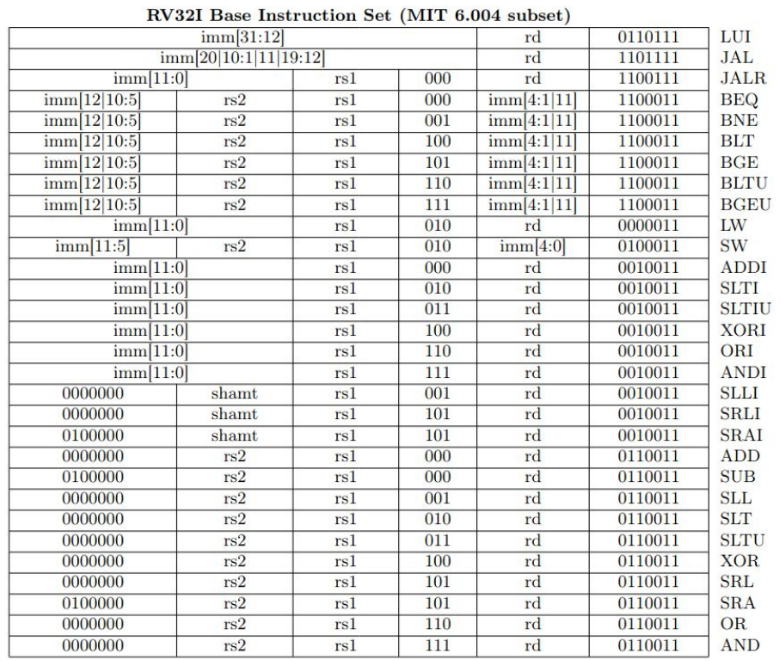
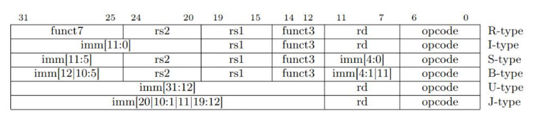
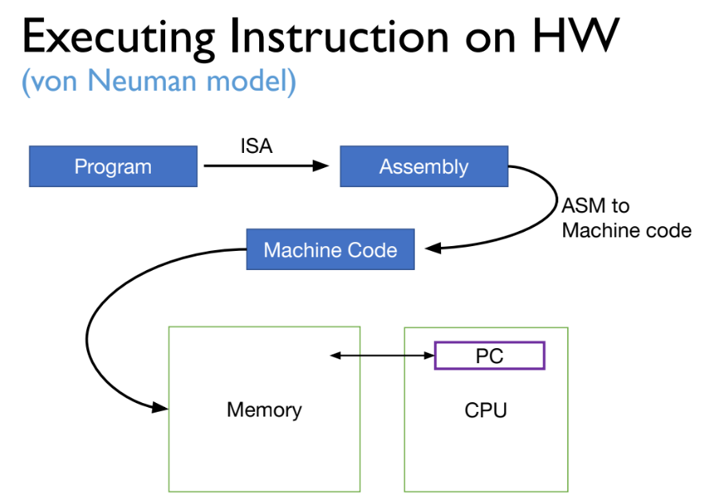
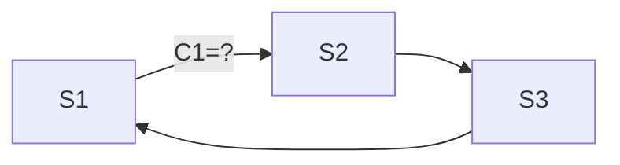
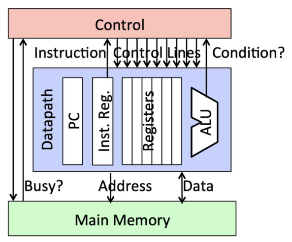

# Microarchitecture Basics

**Lecture 3 | 2023-10-05 | Week 1 (Thursday) |
[Slides](slides/L3-%20Microarchitecture-Basics.pdf)**


## Assembly to Machine Code

Machines only understand *byte streams*, ones and zeroes, so we need an
**assembler** (typically part of the compiler) to generate the machine code from
assembly code.

```
                  <--32bits-->
add x2, x1, xa => 00010...1110
```

To do this, the assembler references some kind of *table* mapping assembly
instructions to their binary representations.


### Machine Code Formats



There are 6 formats of machine code instructions:



The `|` notation for immediates mean *concatenation*. For example,
`imm[12|10:5]` means the concatenation of `imm[12]` and `imm[10:5]`:

```
       imm[10:5]
        vvvvvv
imm = 0001110001101
      ^
    imm[12]

=> 0011100
```

* **R-type:** ALU operations with only registers
* **I-type:** ALU operations but with immediates involved
* **S-type:**
* **B-type:**
* **U-type:**
* **J-type:**

Notice that the best we can do for immediates is $32-5-7 = 20$$ bits (for J-type
instructions) no matter what. Every instruction needs at the minimum 7 bits for
the opcode and 5 bits for some register operand.


### Machine Code Sections

The **opcode** section is shared among all formats, and this determines the
*group* of the instruction. The specific values for each opcode are (basically)
arbitrary -- they're just some unique identifier.

The opcode takes up bits [6:0], meaning it can support $2^7$ different
instruction groups.

Each **register** section is 5 bits long. Recall that this is because we have
exactly 32 registers, so to uniquely identify each one, we need $\log_2(32) = 5$
bits. This is also another reason why we cannot have too many registers. In
addition to power and space constraints, having more registers means needing
more bits for each register in all instructions.

**funct3** (3 bits, [14:12]) and **funct7** (7 bits, [31:25]) are sections that
further identify the instruction since opcodes only distinguish the *group*. But
not all instructions need these sections, so they can use that space to squeeze
in more bits for their immediate operands instead.


## Review: How to Build an ISA: Defining Instructions

* Types of instructions:
  * ALU
  * Memory
  * Control-Flow
* Types of operands:
  * Registers
  * Immediate
  * Memory

And other concepts to look out for, like calling conventions.

Instructions can then be converted into machine code following several
well-defined formats.


## Implementing an ISA

Recall the high-level overview of how instructions are executed on a **von
Neuman model**, where the programmer uses tools to convert a program into a
sequence of bits and placed into a shared memory space with data:



💡 The hardware implementation of an ISA is called **microarchitecture.**

Remember that an ISA is a contract -- given some ISA like RISC-V, the
microarchitecture can be *implemented* in infinite ways, but we're interested in
how to make it *efficient*.


### State-Machine View

Recall the concept of a **finite-state machine:**



The state-machine view is a similar principle:



* The **controller** decides what signals to issue and how to transition from
  one state to another.
* The **datapath** is where the actual activites take place -- adding, loading,
  storing, etc.
* **Main memory** is main memory. It's included because recall that the CPU and
  main memory is tightly coupled in a von Neuman mode.


### Lifecycle of an Instruction

1. Instruction is read (fetched) from the (instruction) memory.
2. Operands should be loaded, possibly from the register file, main memory, from
   immediate values, etc.
3. Operation should be executed -- arithmetic, data movement, control flow.
4. Results should be stored somewhere, back into the register file or main
   memory.
5. PC should be updated to continue our sequential, jump, or branching execution
   flow.


### Review: Logic Design

* **Combinational** elements
  * Get some output as a function of the input
* **Sequential** elements
  * Store data

A **register** is an example of sequential logic as it needs to store data in a
circuit. It uses a **clock signal** to synchronize when to update the stored
value, and it can be (positive/negative) **edge-triggered** -- the action
happens when the clock value *changes*.

Registers can have **write enable**. This means it only updates on the clock
edge AND the write control input is 1 (called active high write enable). This is
used when only sometimes we are allowed to write.

Memory is designed as an *array* of register-like elements.

```
      (example: 8 bits)
  <-----------W----------->
^ +-----+-----+-----+-----+
| |     |     |     |     | <-- memory line
| +-----+-----+-----+-----+
L |     |     |     |     |
| +-----+-----+-----+-----+
| |     |     |     |     |
v +-----+-----+-----+-----+

(example: 1K memory lines for 1K memory)
```

To choose a specific memory line, we use an **address** to *activate* a line. We
use a **multiplexer** to select a specific one.

Memory itself can also be read or write enabled.


### Review: Memory Technology

Memory cells can be registers, SRAM, DRAM, etc. Their design all reflect
trade-offs:

* Registers use latches and flip-flops, enabling very fast and parallel access
  but are very expensive per bit stored. *ns/ps order of speed.*
* Static RAM (SRAM) is relatively fast but only supports reading one word at a
  time and pretty expensive.
* Dynamic RAM (DRAM) is slower, one data word at a time, and reading *destroys*
  the content via refresh, but is cheap and very information-dense.
* DISK (flash memory, hard disk) as we all know is much slower but is
  non-volatile and very cheap. *ms order of speed.*

This trend gives rise to the idea of a **memory hierarchy**, where we use a
combination of all tiers to maximize the best of all worlds.
