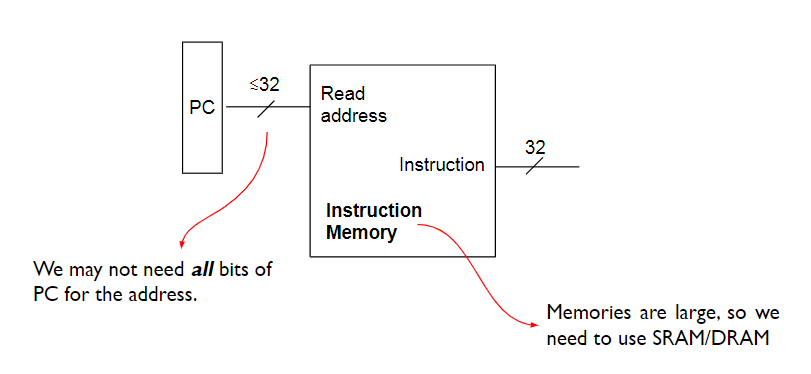
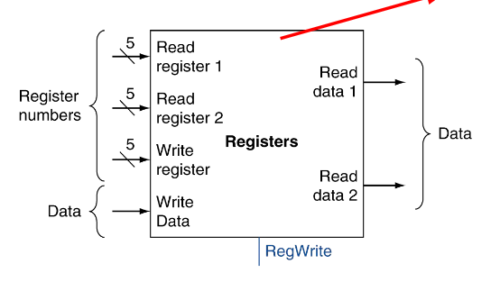
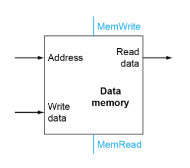
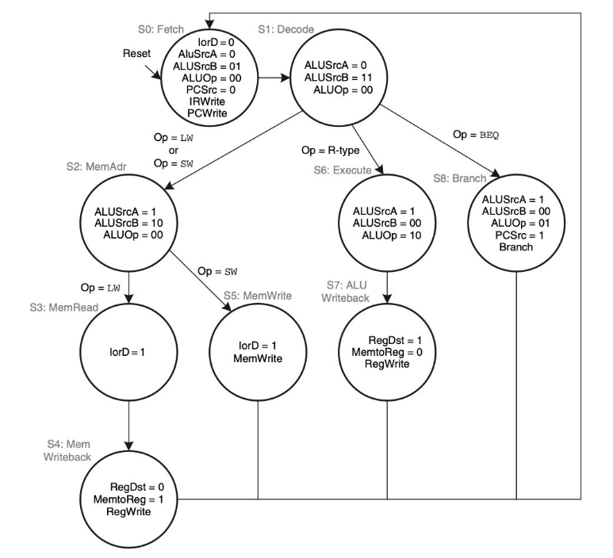
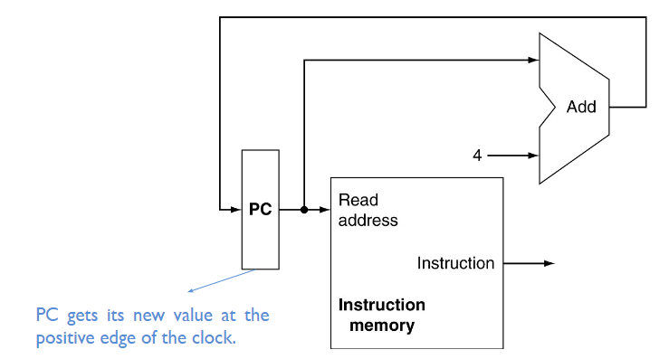
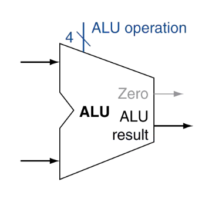
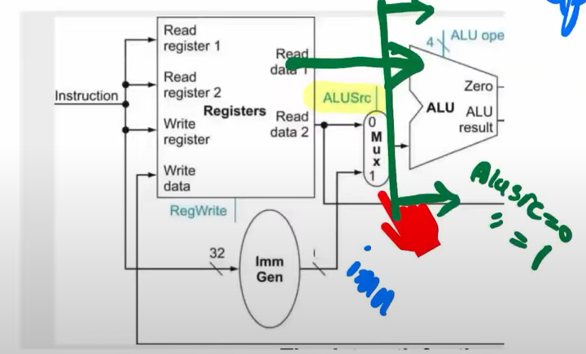
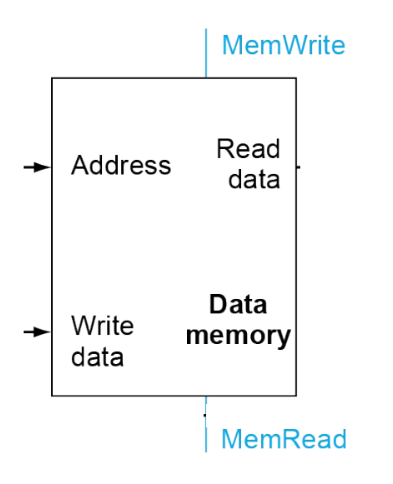
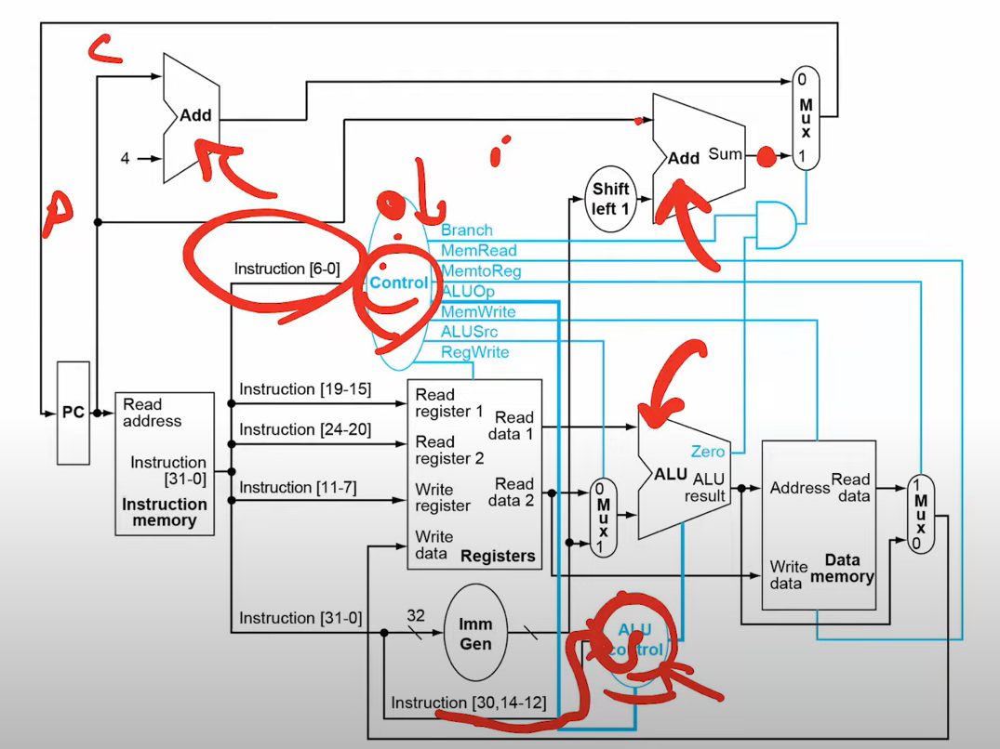
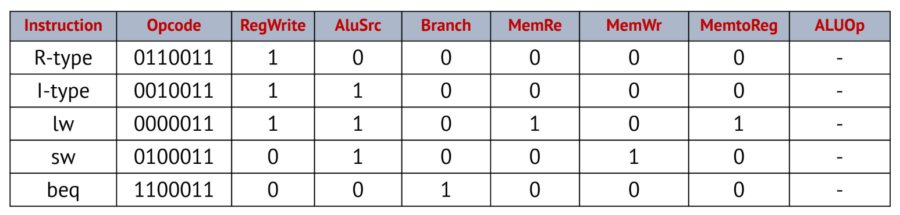

# Microarchitecture Design

**Lecture 4 | 2023-10-10 | Week 2 (Tuesday) |
[Slides](slides/L4-%20Microarchitecture-Design.pdf)**


Small notation note: a slash with a number on it represents how many data lines
the line represents:

```
   32
---/---

   8
---/---
```

This is obviously better than drawing out 32, 8, etc. lines in parallel.


## Instruction Lifecycle


### 1. Instruction Fetch




### 2. Loading Operands

Immediate values are already embedded in the instruction itself, so they don't
need to be "loaded".

For register operands, we interface with the **register file**:



* Read register 1 is `rs1`. Read data 1 is the *value* of `rs1`.
* Read register 2 is `rs2`. Read data 2 is the *value* of `rs2`.
* Write register is `rd`. Write data is the data to write to the register
  determined by `rd`.

The 32-bit instruction is broken down into chunks ([19:15], [24:20], [11:7],
etc.) and connected to different parts of the datapath.

To access memory, we use the **address** to read data out from it or write data
to it:




### Controller

The **controller** is the module that determines *what* instruction to execute.
The **datapath** is a collection of *functional* units that process the data and
create the data-flow. The controller is not *part* of the datapath; rather, the
two work in parallel.

:warning: Since the controller and datapath work at the same time (as in the
instruction "flows" both into the controller and the datapath modules), we need
to make sure the propagation delay for the time it takes for the instruction to
be decoded by the controller to be less than the time it takes for the
instruction to reach a module that requires a control signal from the
controller. This means the clock cycles have to be carefully planned out.

The controller decides what to do by **decoding** the instruction. It takes the
instruction machine code as input and then outputs **control signals** that
themselves are input to the datapath units to determine if they should run (the
"RegWrite", etc. lines).

Controllers are implemented as a giant **finite-state machine (FSM)** with many
states:

1. Initial state: reading the instruction and decoding it.
2. Next state: each instruction has its own state.
3. Future state: depending on the instruction, there could be several states
   (e.g. reading registers, loading memory, arithmetic operations, etc.).
4. Repeat. This is called **single-cycle design**.



This also sheds some light on why we have separate opcode, funct3, and funct7
segments in the design of instruction layouts. The opcode determines the general
*group*, among which all instructions have some kind of similar behavior, so we
have this hierarchical-like structure in the FSM. funct3 and funct7 then further
narrow the exact instruction.


### Datapath

**nextPC**



Notice that we have a dedicated adder that takes in the PC and a hard-coded 4.
This is because on a 32-bit RISC architecture, we know that the next instruction
is always at +4 offset. And of course, it feeds back into PC because it's
updating the PC.

Remember that in real physical design, there is a *delay* between PC updates
because there are delays from the PC to the adder, within the adder, and the
adder back into the PC. Altogether they require multiple clock cycles, where
each part acts on an edge of one clock cycle.

**Register File**

See [Loading Operands](#2-loading-operands).

**ALU**



Note the blue control signal -- this comes from the controller and tells it
*which* operation to perform on the inputs. 4 bits mean $2^4 = 16$ possible
supported operations, as defined in the ISA.

The black data lines are all 32-bit.

Between the instruction and ALU also sits the **Immediate Generator**, which is
responsible for extending immediates encoded in the instruction to the 32 bits
required for the ALU. Internally it has modules to convert a 12 bit input to 32
bits, a 20 bit input to 32 bits, etc. And then all these modules are hooked up
to a multiplexer, and control lines into that multiplexer determine which module
to use based on what instruction it is.

There's also a multiplexer that sits between the ALU and `rs2` from the register
file that determines if the ALU will draw input from `rs2` or the immediate
generator. This is to control whether to use an R-type (register + register) and
I-type instruction (register + immediate)!



**Memory**



The two control signals:

| MemWrite | MemRead | Description |
| -------- | ------- | ----------- |
| 0        | 0       | Neither     |
| 0        | 1       | Loading     |
| 1        | 0       | Storing     |
| 1        | 1       | Undefined   |

Notice that the output of the memory module gets looped back into the register
file at the Write date input -- this is how we write to registers *from* memory.


### Control Signals



High-level idea:

1. Find out what the current instruction is.
   * The wires corresponding to `instruction[6:0]` (the opcode) are what flow
     into the controller. Based on this opcode i.e. the *group* this particular
     instruction belongs to.
   * Some opcodes have multiple candidates, so we use the `funct3` and/or
     `funct7` segments to further decode the instructions.
2. Once the controller knows the instruction, it sets a particular combination
   of these control signals that then individually influence the behavior of
   specific datapath modules (selecting a certain line in a multiplexer,
   `AND`ing with other lines, etc.).

* RegWrite - write to register file.
* ALUSrc - decides between `rs2` and immediate.
* ALUOP - which operation to do in the ALU.
* MemRead, MemWrite - load/store/neighter.
* MemtoReg - decides whether value to be written to register is coming from
  memory or ALU.
* PCSrc - decides whether we load PC + 4 or PC + immediate into the PC.


